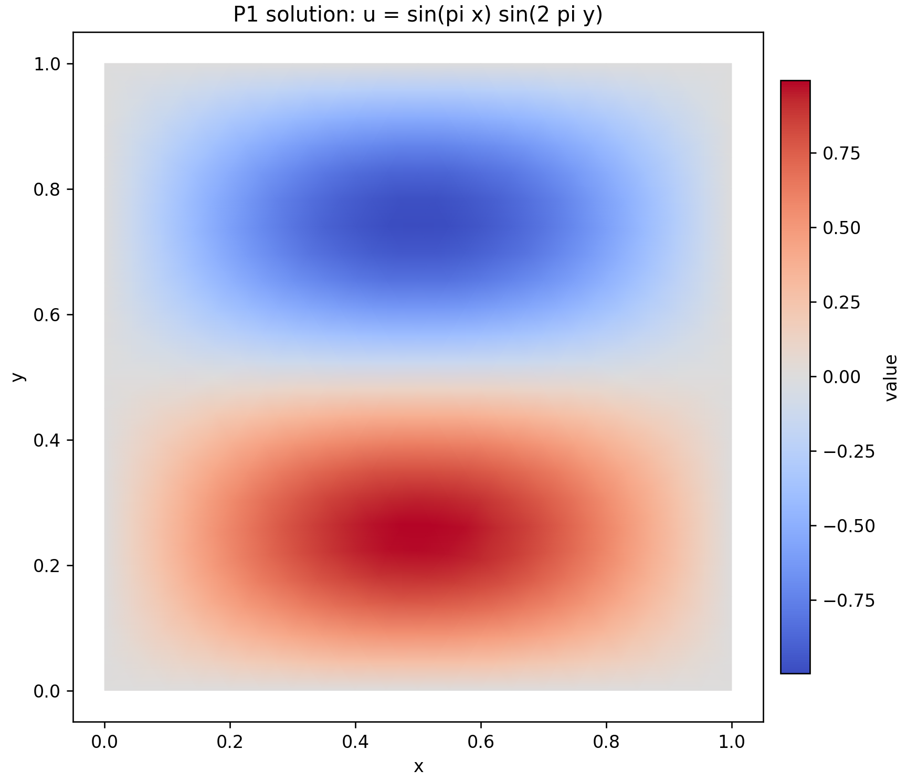

# Basic Poisson solve

This example solves

```text
-Delta u = f
```

with the manufactured solution `u = sin(pi*x) sin(2*pi*y)` and Dirichlet data
on all four sides. It introduces AFEPack template elements, the P1 finite
element space, matrix assembly, boundary conditions, and the algebraic solver.

## Main output

The computed P1 solution reproduces the positive and negative lobes of the
manufactured solution on the unit-square mesh.



Run:

```bash
./run.sh
```

The solution is written to `output/u.dx`, and the program prints the L2 error.

<!-- script-interface -->
## Script interface and portability

`./run.sh [ROOT_MESH]` builds the example and writes `output/u.dx`.
`ROOT_MESH` defaults to `../common/mesh/unit_square/D`. On a different
machine, define the shared `CXX`, `AFEPACK_PREFIX`, `OPENBLAS_PREFIX`,
`BOOST_INCLUDE`, `AFEPACK_PATH`, and `AFEPACK_TEMPLATE_PATH` variables in the
top-level optional `course_config.local` described in the parent README when
their defaults do not match.
