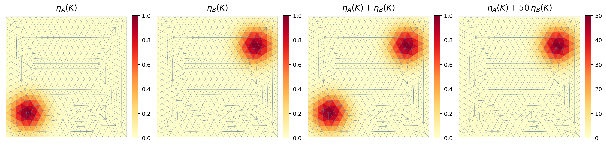
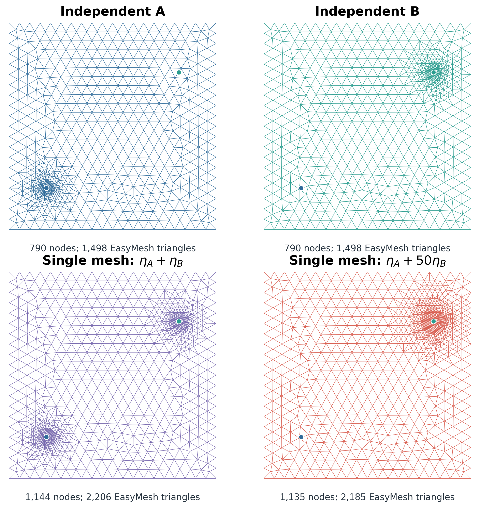

# Why use more than one adaptive mesh?

This example isolates the motivation for multi-mesh adaptation. It does not
solve a PDE. Instead, it starts from one AFEPack root mesh and assigns a
synthetic indicator to every active triangle.

For an element barycenter `x_K`, define two localized demands:

```text
eta_A(K) = exp(-|x_K-x_A|^2 / (2 sigma^2)),
eta_B(K) = exp(-|x_K-x_B|^2 / (2 sigma^2)),
```

with

```text
x_A = (0.18, 0.20),
x_B = (0.82, 0.76),
sigma = 0.10.
```

The indicators are deliberately simple: a triangle is important when it is
close to one selected point.

## Main results

The indicator plot shows the two independent demands, their equal-scale sum,
and the scale-dominated sum.



The final meshes expose the consequence: independent refinement preserves
both requests, whereas the factor-50 combined indicator spends essentially
all of its shared marking budget near the upper-right target.



## Four refinement experiments

The run generates four meshes from the same root:

1. `independent_A`: mark the largest 5% of `eta_A`;
2. `independent_B`: mark the largest 5% of `eta_B`;
3. `equal_sum`: mark the largest 10% of `eta_A + eta_B`;
4. `scaled_sum`: mark the largest 10% of `eta_A + c eta_B`, with `c = 50`.

The combined cases use a 10% rule to represent two local 5% demands. Most
importantly, the equal-sum and scaled-sum runs use exactly the same marking
fraction and have comparable final mesh sizes; only the relative indicator
scale changes.

When both indicators have the same scale, a single combined indicator can
refine both regions. After multiplying the second indicator by 50, the largest
10% are selected almost entirely near `x_B`; the `x_A` demand receives no
effective budget.

This is not a failure of addition. It exposes an extra modeling choice:

```text
before adding two indicators, one must decide their relative scale.
```

Normalizing, taking a maximum, or prescribing separate weights can repair a
particular example, but each introduces a cross-target policy. The multi-mesh
alternative keeps the marking decisions independent:

```text
eta_A -> mesh A,
eta_B -> mesh B,
then merge the two refinement histories.
```

The following example, `02_mesh_merge`, implements the final merge. Multi-mesh
does not make the indicators more accurate; it prevents one target's numerical
scale from consuming another target's refinement budget.

## Run

```bash
./run.sh [ROOT_MESH] [ROUNDS] [LOCAL_FRACTION] [SCALE_B]
```

Defaults:

```text
ROOT_MESH      = ../common/mesh/unit_square/D
ROUNDS         = 3
LOCAL_FRACTION = 0.05
SCALE_B        = 50
```

For example:

```bash
./run.sh ../common/mesh/unit_square/D 3 0.05 50
```

## Outputs

```text
output/D_root.[nse]
output/D_refine_lower_left.[nse]
output/D_refine_upper_right.[nse]
output/D_combined_equal.[nse]
output/D_combined_scaled.[nse]

output/indicator_fields.csv
output/marking_history.csv

output/figures/01_indicator_scaling.png
output/figures/02_refinement_comparison.png
output/figures/03_marking_allocation.png
```

`D_refine_lower_left` and `D_refine_upper_right` retain the names used by the
earlier peer-mesh example. The `.mesh` and `.dx` versions are also written.

The C++ program first ranks the element indicators, then passes a binary
selected/not-selected `Indicator<2>` to `MeshAdaptor`. Therefore the selected
element count is explicit and comparable between the four experiments.

The older one-point command remains available for small experiments:

```bash
./local_refine ROOT_MESH OUTPUT_NAME CENTER_X CENTER_Y RADIUS ROUNDS
```

<!-- script-interface -->
## Script files and portability

| file | usage | output |
|---|---|---|
| `run.sh` | `./run.sh [ROOT_MESH] [ROUNDS] [LOCAL_FRACTION] [SCALE_B]` | meshes/CSV in `output/`, PNGs in `output/figures/` |
| `plot_indicator_study.py` | `python3 plot_indicator_study.py OUTPUT_DIR [--scale-b FLOAT]` | three PNG files in `OUTPUT_DIR/figures/` |

The shell defaults are `../common/mesh/unit_square/D 3 0.05 50`. Set
`PLOT_PYTHON` in the top-level optional `course_config.local` if the plotting
packages are installed in a non-default Python environment. Build-path
variables are listed in the parent README.
