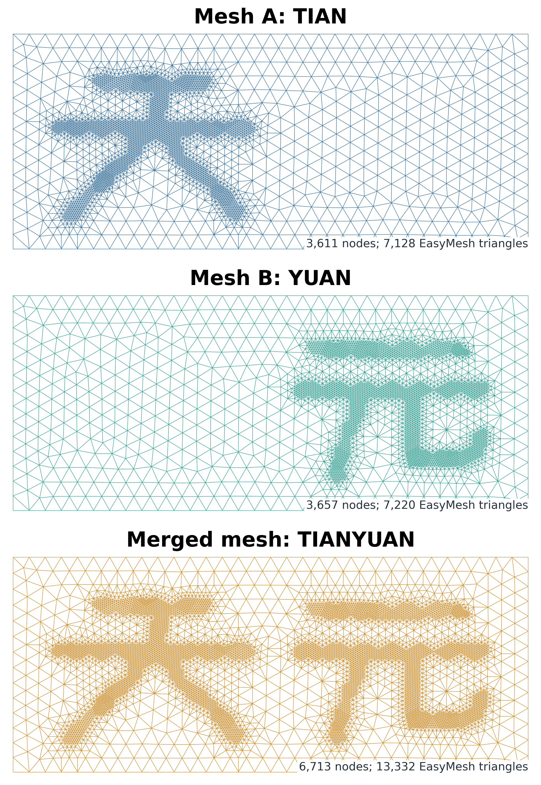

# Tianyuan mesh merge

This example turns AFEPack mesh merging into a visual construction.  The
domain is the rectangle

```text
[0, 2.4] x [0, 1].
```

Inside it, the Chinese characters **Tian** and **Yuan** are represented by
unions of thick line segments.  For a triangle `K`, let `x_K` be its
barycenter and let `S_Tian` and `S_Yuan` be the two closed stroke sets.  The
binary indicators are

```text
eta_Tian(K) = 1  if d(x_K, S_Tian) = 0, and 0 otherwise,
eta_Yuan(K) = 1  if d(x_K, S_Yuan) = 0, and 0 otherwise.
```

Thus the distance is not used as a continuously varying error indicator:
only triangles whose barycenters lie inside a stroke are refined.

## Main output

The two peer meshes refine Tian and Yuan independently. The common mesh
contains the union of both refinement histories.



## What is merged

Both peer meshes start from one AFEPack `HGeometryTree<2>`.

1. Mesh A repeats the Tian indicator for several refinement rounds.
2. Mesh B independently repeats the Yuan indicator.
3. `CommonIrregularMesh` copies Mesh A and recursively inserts every refined
   branch present in Mesh B.
4. AFEPack semiregularizes and regularizes the result.

The common mesh is the union of the two refinement histories.  It therefore
contains both characters without adding or scaling the two indicators.

## Run

```bash
./run.sh [ROUNDS] [STROKE_HALF_WIDTH]
```

The defaults are

```bash
./run.sh 3 0.035
```

`tianyuan_rectangle.d` is passed to EasyMesh to build the shared rectangular
root mesh. Configure a non-default EasyMesh executable once in the top-level
`course_config.local`.

The main outputs are:

- `output/T_tian.[nse]`: the Tian peer mesh;
- `output/T_yuan.[nse]`: the Yuan peer mesh;
- `output/T_common.[nse]`: the merged Tianyuan mesh;
- `output/glyph_distance_field.csv`: the exact zero/nonzero decisions on the
  root triangles;
- `output/figures/tianyuan_merge_overview.png`: all three meshes;
- `output/figures/glyph_distance_zero_masks.png`: the two indicator masks.

The `.mesh` and `.dx` versions are also written for AFEPack and OpenDX.

## Original circular demo

The earlier two-circle refinement and Poisson solve remain available:

```bash
./run_circles.sh
```

That auxiliary example writes `D_left`, `D_right`, `D_common`, and
`u_common.dx` below `output/`.

<!-- script-interface -->
## Script files and portability

| file | usage | output |
|---|---|---|
| `run.sh` | `./run.sh [ROUNDS] [STROKE_HALF_WIDTH]` | Tian/Yuan/common meshes and CSV in `output/`, PNGs in `output/figures/` |
| `run_circles.sh` | `./run_circles.sh [ROOT_MESH]` | circle peer/common meshes and `u_common.dx` in `output/` |
| `plot_tianyuan_merge.py` | `python3 plot_tianyuan_merge.py OUTPUT_DIR` | PNG files in `OUTPUT_DIR/figures/` |

Set `EASYMESH_BIN` and `PLOT_PYTHON` once in the top-level optional
`course_config.local` if auto-detection is unsuitable.
The AFEPack/OpenBLAS/Boost build and runtime variables are documented in the
parent README.
