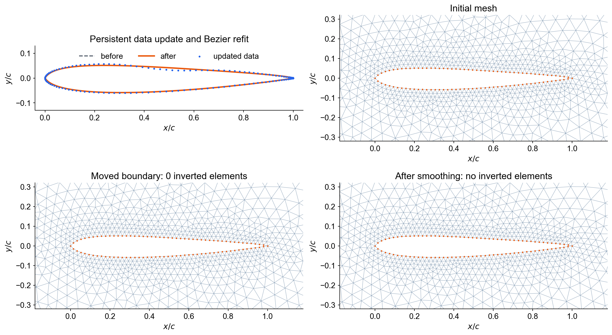

# Airfoil boundary fitting, mesh motion, and smoothing

This example isolates the geometry and mesh operations from the Euler solver.
It demonstrates three separate steps:

1. fit the upper and lower airfoil data with regularized Bezier curves;
2. sample the fitted curves and use the samples as EasyMesh boundary points;
3. move only the airfoil boundary vertices of the AFEPack mesh, then smooth
   only the interior vertices without changing element connectivity.

No PDE is assembled or solved, and no adaptive refinement is performed.

## Main output

The overview follows one persistent action from the updated airfoil data and
Bezier refit through boundary motion and interior smoothing. Connectivity is
unchanged and no element is inverted.



## Relation to the Euler example

`airfoil_bezier.hpp` is a standalone extraction of only the airfoil-data and
Bezier parts of `RL/include/circleAirfoil.h`. In particular, the teaching
example keeps the ideas implemented by:

```text
LSFittingSmooth()
setup_piecewiseCurve()
generate_easymeshPoints()
```

The Euler solver, reinforcement-learning classes, and curvature adaptation are
not copied. The original fitting routine uses GSL for its linear algebra; this
small example solves the same regularized least-squares problem with
`LAPACKE_dgels`, matching the numerical libraries available with the local
AFEPack build.

## Run

### One persistent geometry action

The classroom command-line example is:

```bash
python3 airfoil_step.py 0.5 U -0.01
```

It means: center a Gaussian action at `x/c = 0.5`, apply it to the upper
surface (`U`), and request a peak downward displacement of `-0.01`. All
`x` coordinates stay fixed. For the selected surface, only `y` changes:

```text
y_new(x_i) = y_old(x_i)
             + clipped_shift * exp(-0.5*((x_i-center)/width)^2).
```

The leading- and trailing-edge data are held fixed. `L` selects the lower
surface. The default Gaussian width is `0.12`; for example:

```bash
python3 airfoil_step.py 0.72 L 0.008 --width 0.10
```

For a large boundary displacement, increase the number of relaxed Laplacian
smoothing sweeps:

```bash
python3 airfoil_step.py 0.50 U 0.10 --smooth-iterations 200
```

The default is 50 sweeps. The command-line value is clipped to `[1,1000]`.

To apply more smoothing to the current persistent mesh without changing the
airfoil geometry, refitting the Bezier curves, or calling EasyMesh, omit the
three geometry arguments:

```bash
python3 airfoil_step.py --smooth-iterations 200
```

This uses `output/mesh_current.mesh` as the input mesh, keeps every boundary
vertex fixed, smooths only boundary-mark-0 interior vertices, validates the
result, and then replaces the persistent mesh. The same numbered mesh figures
and `mesh_motion_overview.png` are regenerated for the smoothing-only step.

The persistent files are:

```text
data/naca0012_original.dat   immutable backup
data/naca0012_working.dat    geometry updated by every successful action
output/mesh_current.mesh     mesh carried from one action to the next
output/boundary_current.dat  airfoil boundary represented by that mesh
```

The working file is created automatically. Each action reads its current
contents, writes a candidate geometry, moves the persistent mesh to that
geometry, and updates both persistent files only if smoothing produces a valid
mesh. EasyMesh is called for the first action only. Later actions reuse
`mesh_current.mesh` without changing element connectivity.

Reset the geometry and remove the persistent mesh with:

```bash
python3 airfoil_step.py --reset
```

The input is clipped before it reaches the geometry:

- `center` is clipped to `[0.05, 0.95]`;
- `width` is clipped to `[0.04, 0.30]`;
- the default single-action limit is `|shift| <= 0.10`;
- the accumulated displacement from the original airfoil is limited to
  `|y-y_original| <= 0.10`;
- a thickness-dependent limit prevents the upper and lower surfaces from
  crossing when an action reduces local thickness.

After updating the data, the example independently fits the old and new
surfaces, generates matching boundary points, moves the current mesh to the new
boundary, applies AFEPack Laplacian smoothing, checks for inverted elements,
and creates the figures. If the validity check fails, neither the working
geometry nor the persistent mesh is committed.
Use `--show` to open the overview automatically on macOS:

```bash
python3 airfoil_step.py 0.5 U -0.01 --show
```

### Built-in fixed test

```bash
./run.sh
```

The default input is `data/naca0012.dat`. The prescribed test motion is a
smooth bump centered at `x = 0.35`; it vanishes at the leading and trailing
edges. The small finite trailing-edge thickness in the source data is closed
before fitting so that EasyMesh does not create a sliver at the trailing edge.

The main outputs in `output/` are:

```text
airfoil.d
airfoil.[nse]
airfoil.mesh
mesh_current.mesh
boundary_current.dat
mesh_update_mode.txt
airfoil_moved.dat
fit_initial.csv
fit_moved.csv
boundary_initial.dat
boundary_moved.dat

mesh_initial.dx
mesh_moved_unsmoothed.dx
mesh_smoothed.dx

mesh_initial.mesh
mesh_moved_unsmoothed.mesh
mesh_smoothed.mesh

mesh_*_nodes.csv
mesh_*_elements.csv
quality_summary.csv

figures/00_data_update.png
figures/01_bezier_fit.png
figures/02_mesh_initial.png
figures/03_mesh_moved_unsmoothed.png
figures/04_mesh_smoothed.png
figures/mesh_motion_overview.png
```

The three `mesh_*.mesh` files have identical node numbering and identical
element connectivity. Only node coordinates change.

For the default test, the mesh contains 1991 vertices and 3822 triangles.
Moving the airfoil without smoothing creates 49 inverted triangles and lowers
the minimum shape quality from 0.865 to 0.019. Fifty relaxed Laplacian sweeps
remove all inverted triangles and recover a minimum quality of 0.858, without
changing connectivity.

## What the two programs do

`generate_airfoil_geometry` contains only the geometry preparation:

```text
UIUC airfoil data
  -> regularized Bezier least-squares fit
  -> approximately uniform arc-length sampling
  -> EasyMesh boundary description
```

`move_and_smooth` contains only the AFEPack mesh operations:

```text
read the persistent AFEPack mesh
  -> match boundary-mark-3 vertices
  -> replace their coordinates
  -> rebuild vertex adjacency
  -> relaxed Laplacian smoothing of boundary-mark-0 vertices
  -> reject the action if an inverted element remains
```

The smoothing uses a Jacobi update. Neighbor coordinates are read again at
each iteration, while all boundary vertices remain fixed:

```text
x_i(new) = x_i(old) + lambda * (average(neighbors) - x_i(old)).
```

This differs from adaptive refinement: the geometry arrays and element
connectivity are never resized or rebuilt.

For a sequence of actions the complete mesh path is:

```text
first action:
    EasyMesh -> mesh_current.mesh

every action:
    mesh_current.mesh
      -> move airfoil boundary nodes
      -> Laplacian smooth interior nodes
      -> validate signed triangle areas
      -> replace mesh_current.mesh
```

The generated `airfoil.d` remains useful for inspecting the current fitted
geometry, but it is not sent to EasyMesh after the persistent mesh has been
initialized.

## Visualization

`run.sh` automatically calls `visualize_results.py` when Matplotlib is
available. The four numbered PNG files use identical plotting conventions, and
`mesh_motion_overview.png` collects the entire workflow into one figure.

To regenerate only the figures without rerunning EasyMesh or AFEPack:

```bash
python3 visualize_results.py output
```

If Matplotlib belongs to a different Python environment:

```bash
PLOT_PYTHON=/path/to/python ./run.sh
```

The `.dx` files can additionally be opened in an OpenDX-compatible viewer.

<!-- script-interface -->
## Script interfaces and machine-specific settings

| file | usage | output |
|---|---|---|
| `airfoil_step.py` | `python3 airfoil_step.py CENTER {U,L} SHIFT [OPTIONS]`; use `--help` for safety/smoothing flags | persistent state and figures in `output/` |
| `run.sh` | `./run.sh [DATA_FILE] [OUTPUT_DIR] [MOVED_DATA_FILE] [SMOOTH_ITERATIONS] [move|smooth-only]` | meshes, CSV/DX diagnostics, and figures in `OUTPUT_DIR` |
| `visualize_results.py` | `python3 visualize_results.py OUTPUT_DIR [--figure-dir DIR]` | PNG files in the selected figure directory |

Set `EASYMESH_BIN`, `EASYMESH2MESH_BIN`, and `PLOT_PYTHON` if those tools
are not discoverable at their defaults. The backend build also uses the shared
`CXX`, `AFEPACK_PREFIX`, `OPENBLAS_PREFIX`, and `BOOST_INCLUDE`
variables documented in the parent README.
