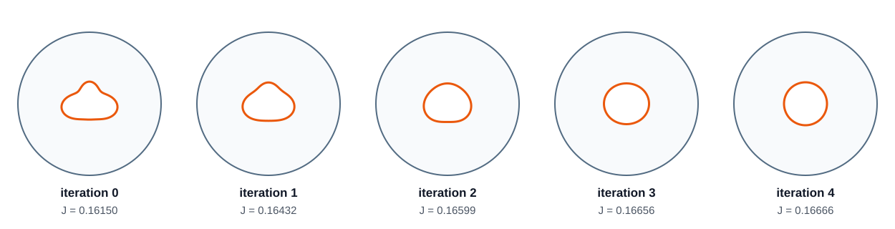

# Poisson optimization of an internal hole

This example keeps a circular outer computational boundary fixed and optimizes
the shape of an internal hole. The domain is

```text
D        = disk of radius R = 2,
S(p)     = variable internal hole,
Omega(p) = D minus S(p).
```

A uniform heat source acts in `Omega(p)`. Both the fixed outer wall and the
variable hole wall are maintained at zero temperature:

```text
-Delta T = 1 in Omega(p),
       T = 0 on outer_boundary(D),
       T = 0 on boundary(S(p)).
```

The objective is to maximize the mean steady temperature:

```text
J(p) = (1 / |Omega(p)|) integral_Omega(p) T dx.
```

Only the internal boundary is parameterized:

```text
r(theta) = s(p) [
    1 + a2 cos(2 theta) + b3 sin(3 theta) + a4 cos(4 theta)
].
```

The scale `s(p)` fixes the hole area at `pi * 0.6^2`. A final correction makes
the sampled EasyMesh hole polygon have exactly the same area for every
candidate. The outer circle, its radius, and its sampled boundary points never
change.

The initial hole coefficients are:

```text
a2 =  0.20
b3 = -0.15
a4 =  0.10
```

The reference configuration is the concentric circular annulus
`a2 = b3 = a4 = 0`. For a circular hole of radius `a` inside a circular outer
boundary of radius `R`, the exact radial temperature is

```text
T(r) = -r^2/4 + C log(r) + D,
C = (R^2 - a^2) / (4 log(R/a)),
D = a^2/4 - C log(a).
```

For `R = 2` and `a = 0.6`, the exact mean temperature is approximately
`0.167084`.

## Main output

Four coordinate-search sweeps transform the fixed-area irregular hole toward
the optimal concentric circle while increasing the mean temperature.



## Run

```bash
./run.sh
```

The executable is entirely C++. For every candidate it writes a two-boundary
EasyMesh description, remeshes the region between the fixed outer circle and
the variable hole, solves the P1 Poisson problem with AFEPack, integrates the
objective, and performs coordinate search. Python is not required.

The default run performs four coordinate-search sweeps:

```bash
./run.sh output 4
```

## Outputs

```text
output/history.csv
output/summary.txt
output/shape_comparison.svg
output/shape_history.svg
output/mesh_history.svg

output/iterations/iter_000/
output/iterations/iter_001/
...

output/reference_annulus/
```

Every saved iteration contains:

```text
outer_boundary.csv
shape.csv
shape.d
shape.n / shape.e / shape.s
mesh.svg
temperature.dx
temperature.svg
parameters.txt
```

`shape.csv` contains the variable hole boundary. `outer_boundary.csv` is fixed.
`mesh.svg` shows the EasyMesh triangulation of `D minus S(p)`.
`temperature.svg` overlays the computed temperature and mesh.
`shape_history.svg` and `mesh_history.svg` show every accepted configuration at
the same physical scale.

<!-- script-interface -->
## Launcher interface and portability

`./run.sh [OUTPUT_DIR] [SWEEPS]` builds and runs the optimizer. Defaults are
`output/` and four coordinate-search sweeps; all history, fields, meshes, and
iteration directories stay below `OUTPUT_DIR`.

Set `EASYMESH_BIN` and the shared AFEPack/OpenBLAS/Boost build/runtime paths in
the top-level optional `course_config.local` when the supplied `$HOME` and
`/opt/local` defaults do not match the current machine.
