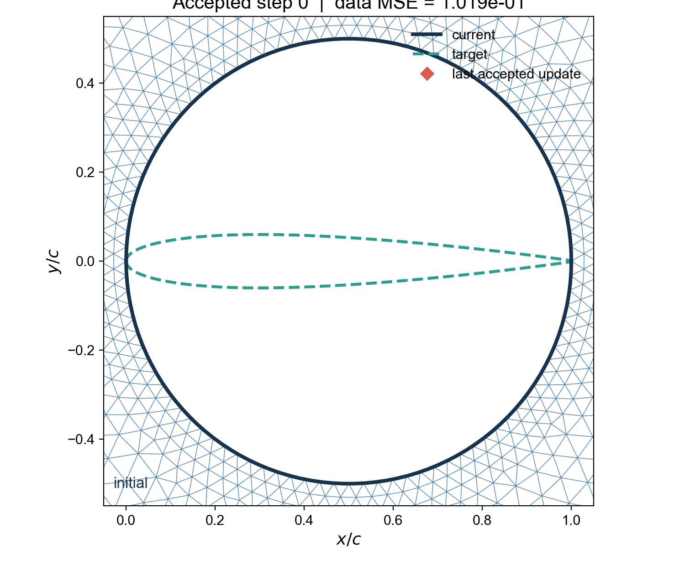
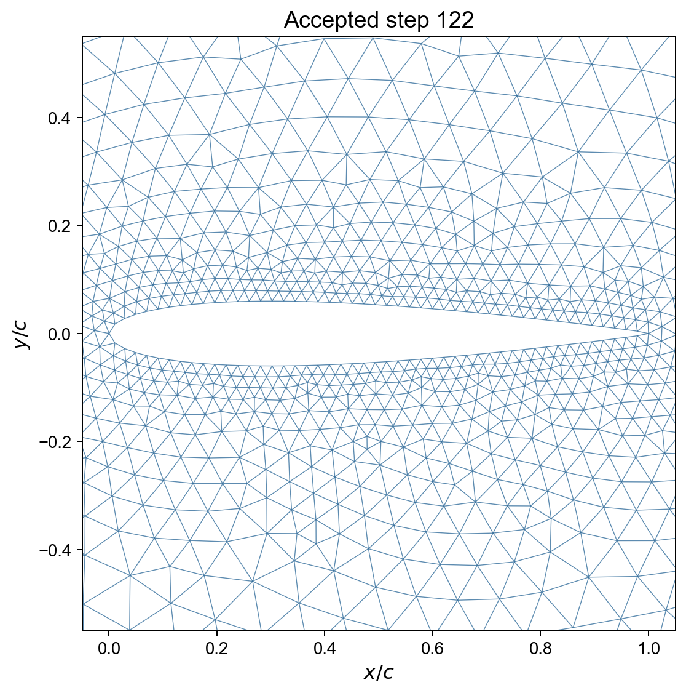

# Airfoil boundary control with an online digital twin

This example contains no CFD solver.  It learns how one fixed-width Gaussian
boundary action changes the distance between the current and target airfoil
meshes.

The initial obstacle is a radius-0.5 circle centered at `(0.5, 0)`.  The outer
far-field circle has the same center.  The target is NACA0012.  Both shapes use
the same fixed leading and trailing edges, `(0, 0)` and `(1, 0)`.

## Result animations

The marker identifies each accepted real boundary update selected by the
online digital twin. The dashed curve is the fixed NACA0012 target.


The mesh view reconstructs the real AFEPack triangular mesh after each
selected accepted update. It includes the frames immediately before and after
every EasyMesh remeshing event, so both fixed-topology motion and topology
changes remain visible.



## Main output figure

The final static frame is suitable for lecture notes and shows the converged
NACA0012 boundary together with the real locally refined AFEPack mesh.



## What is measured

The current and target UIUC-style `dat` files use the same fixed x-grid.  The
two fixed endpoints are omitted and the loss directly compares the 128
movable upper/lower ordinates:

\[
J_{\mathrm{dat}}
=
\frac{1}{2(N-2)}
\sum_{i=1}^{N-2}
\left[
(y_{U,i}-y_{U,i}^\star)^2
+(y_{L,i}-y_{L,i}^\star)^2
\right].
\]

This is ordinary mean squared error.  AFEPack and EasyMesh are still used for
every real transition, smoothing, mesh-quality validation, rollback, and
remeshing, but mesh vertices do not enter the objective.

## State, action, and real transition

The 128-dimensional state is read directly from the current UIUC-style `dat`
file:

```text
64 movable upper y values + 64 movable lower y values
```

The two fixed endpoints are omitted.  One action is:

```text
(surface U/L, center x, peak shift)
```

The Gaussian center can range over the full chord, `0 <= x <= 1`.  Only the
two endpoint coordinates are fixed; neighboring points such as `x=0.01` keep
their full Gaussian weight even when the center is `x=0` or `x=1`.  The
Gaussian width is fixed at `0.12`.  The action bank uses peak magnitudes
`0.005`, `0.01`, `0.02`, `0.03`, and `0.04`, so large early changes and small
late corrections use the same transparent controller.  While data MSE is
above `0.01`, only `0.02`, `0.03`, and `0.04` are active; the two fine actions
are unlocked below that threshold.  Gaussian weights below `1e-2` are
truncated to zero, so a thickness constraint at a remote point cannot
suppress an unrelated local action.  Every real transition runs exactly 200 relaxed
Laplacian smoothing sweeps.  Failed or inverted meshes are rolled back.  The
reward is:

```text
reward = loss_before - loss_after
```

## Code layout

```text
backend/
  airfoil_bezier.hpp            Bezier fitting and EasyMesh boundary output
  generate_airfoil_geometry.cpp centered initial/target geometry
  move_and_smooth.cpp           fixed-topology AFEPack mesh transition

dt_airfoil/
  geometry.py                   dat I/O, data MSE, and safe Gaussian action
  pointcloud.py                 mesh-boundary extraction for diagnostics
  environment.py                reset, real step, validation, commit/rollback
  replay.py                     persistent transition and policy datasets
  models.py                     digital-twin and direct-policy MLPs
  learning.py                   training and inference

prepare_case.py                 build independent initial/target meshes
collect_random.py               robust random warm-up
train_twin.py                   fit state/action -> reward
optimize_with_twin.py           rank actions, verify one, update online
run_twin_controller.py          robust model-based final controller
run_policy.py                   optional continuous direct-policy comparison
render_trajectory.py            rebuild the GIF from the recorded CSV
run_experiment.py               run all five stages in order
reset_project.py                remove reproducible experiment state
```

## Complete run

To start a new experiment from a completely clean state:

```bash
python3 run_experiment.py --reset --seed 2026
```

The data metric is part of every replay reward and twin target.  After
changing it, always use `--reset`; checkpoints or replay rows produced by an
earlier metric are not compatible with this loss.

This runs the five stages in order: reference mesh preparation, random
transition collection, digital-twin training, twin-assisted optimization, and
the model-based twin rollout.  The last stage records the accepted `dat`
history and renders the GIF.

## Reproducible lecture run

For the classroom demonstration, use the checked-in fixed recipe:

```bash
./run_teaching_demo.sh
```

It always resets generated state, uses master seed `2026`, and passes derived
seeds explicitly to random transition collection, initial twin training,
twin-assisted optimization, and online controller retraining.  PyTorch is
restricted to deterministic CPU algorithms and one thread.  The launcher uses `$HOME/anaconda3/bin/python` when available; another
interpreter can be selected with:

```bash
PYTHON_BIN=/path/to/python ./run_teaching_demo.sh
```

Every run writes `output/run_configuration.json`, containing all arguments,
the four stage seeds, and the Python, NumPy, and PyTorch versions.  Exact action
sequence reproduction assumes the same machine, EasyMesh binary, and software
environment.  `--reset` is essential: without it, old replay samples and model
weights intentionally become part of the continued experiment.

The training sequence is:

1. collect real boundary-motion and smoothing transitions;
2. fit the digital twin to predict real objective improvement
   `(state, action) -> reward`;
3. let the twin rank candidate actions and verify the selected action on the
   real mesh;
4. add every accepted or rejected real trial to replay and retrain the twin;
5. record the accepted shape history and render the final animation.

The default 20-step final rollout is intentionally short.  A more useful
long run for the circle-to-airfoil deformation is:

```bash
python3 run_experiment.py --reset \
  --seed 2026 \
  --warmup-episodes 10 --warmup-steps 10 \
  --twin-epochs 1000 \
  --optimization-episodes 8 --optimization-steps 20 \
  --controller-steps 180 --candidates 512 --max-real-trials 12 \
  --min-improvement 1e-8 --minimum-mesh-quality 0.40 \
  --exploration-bonus 1e-3 --twin-safeguard-ratio 0.25 \
  --fine-action-threshold 0.01
```

`--min-improvement` prevents a nearly zero displacement from consuming
an accepted step.  Such an action is still evaluated and learned by the
digital twin, but the geometry is rolled back and the corrected twin searches
for a stronger recovery action.

The default final controller uses a finite, transparent, bidirectional action
bank over the full chord.  It can both reduce thickness and restore thickness
where an earlier action overshot the target.  At each center, a signed geometry
mask keeps only the direction that points toward the target data curve.  The
network still proposes the surface, center, and magnitude, while the direct
upper/lower `dat`-sample MSE accepts or rejects the real transition.
Candidates whose geometric thickness guard produces a zero effective shift are
removed before any real mesh solve.  For each state, the digital twin predicts
the reward of every remaining candidate and the real AFEPack mesh verifies the
highest-ranked one.  Upper- and lower-surface actions always share the same
candidate pool.  Because the `dat` objective is cheap in this teaching
problem, a deterministic safeguard replaces an NN proposal whose exact
improvement is less than 25% of the best current candidate.  If the selected
proposal is rejected, the same objective ranks the remaining candidates for
recovery.  Every action must still pass the real AFEPack mesh-motion and
quality checks.
If an action inverts a cell, its shift is halved and retried; the invalid
result also updates the twin.  This avoids the mode collapse that can occur
when a continuous direct policy is trained from several equally good action
labels.  `run_policy.py` remains available as an advanced comparison.

Only the exact leading- and trailing-edge samples are fixed.  A Gaussian
centered at `x=0` or `x=1` still moves nearby interior samples such as
`x=0.01`; no endpoint taper suppresses that motion.  Coarse shifts are used
while the data MSE exceeds `--fine-action-threshold`, then 0.005 and 0.01
corrections are enabled for the final fit.

The controller also enforces `minimum mesh quality >= 0.40`.  A positive-area
mesh with lower quality is already close to degeneration, so it is rejected
before a later action can invert it.  By default, the candidate geometry is
then sent to EasyMesh.  If the rebuilt mesh passes the same quality threshold
and improves the objective, the new topology becomes the persistent mesh.
Otherwise the candidate is rolled back.  Use `--no-remesh` only for the
fixed-topology comparison.

Mesh quality is a local triangle metric; it cannot by itself reject an
airfoil that has developed an unrealistic narrow neck.  Since the initial
circle encloses the target, a separate target-envelope guard projects every
inward update onto the NACA0012 upper or lower surface before it can cross
that surface.  Consequently, a clean rollout remains outside the target and
cannot become locally thinner than it.  This pointwise projection is checked
before mesh motion or remeshing; a point that has reached the target does not
freeze neighboring points in the same Gaussian support.

Every accepted topology change is archived below `output/history/` as
`remeshed_NNNN.mesh` together with its node and element CSV files.  The
corresponding trajectory frame has `EasyMesh remesh` in the `source` column of
`data_history.csv`.

Because both the initial circle and NACA0012 target are symmetric, accepted
upper- and lower-surface action counts are kept within one of each other.  The
twin still chooses the full-chord center and magnitude on the currently
allowed surface.  This explicit symmetry prior prevents a small data set from
spending the entire real-mesh budget on one side of the obstacle.

Candidate ranking adds a decaying coverage bonus of `1e-3 / sqrt(1+n)`, where
`n` is the number of accepted visits to that surface/center.  It encourages
early exploration across the chord, while the learned reward dominates after
the action locations have been sampled.

To continue from the existing replay data and models instead of starting over:

```bash
python3 run_experiment.py
```

The individual commands used by the complete runner are:

Use the Python installation that provides NumPy and PyTorch:

```bash
python3 prepare_case.py
python3 collect_random.py --episodes 6 --steps 5 --fresh
python3 train_twin.py
python3 optimize_with_twin.py --episodes 4 --steps 5
python3 run_twin_controller.py --steps 80 --max-real-trials 10
```

## Reset

To discard all generated meshes, replay samples, trained models, optimization
history, plots, and the temporary working `dat` file:

```bash
python3 reset_project.py
```

This deletes `output/` and `data/working.dat`.  It preserves the initial circle,
the target NACA0012 data, all source files, and compiled backends.  The next
complete run rebuilds the initial and target reference meshes automatically.

To reset the C++ build products as well:

```bash
python3 reset_project.py --clean-build
```

The equivalent one-command clean run, including a C++ rebuild, is:

```bash
python3 run_experiment.py --reset --clean-build
```

`prepare_case.py` calls EasyMesh and AFEPack only when the cached reference
meshes do not exist.  A reset copies the cached initial mesh, so resetting an
episode does not remesh.

During warm-up, 70% of the random actions use the direction expected to reduce
the circle thickness and 30% deliberately move the wrong way.  This gives the
twin both positive and negative examples.  After warm-up, the twin ranks many
candidate actions cheaply, but only one selected action is evaluated on the
real AFEPack mesh.  Accepted twin actions are used to train the direct policy.

The optional `run_policy.py` comparison is also verified online rather than
open loop.  It executes each continuous policy action on the real mesh, uses
the result to update the twin, and asks the corrected twin for recovery after
a rejection.

At the start of either final controller, the initial `dat` state is written to
one long-format file:

```text
output/policy_rollout/data_history.csv
```

Every accepted update appends its complete upper and lower `dat` values to that
same file.  Rejected actions do not appear as shape changes because the real
geometry is rolled back; their negative outcomes remain in `replay.jsonl`.
At normal program completion, the history is rendered automatically as:

```text
output/policy_rollout/shape_evolution.gif
output/policy_rollout/shape_final.png
```

The animation can be regenerated at the README resolution without rerunning
the optimizer:

```bash
python3 render_trajectory.py --fps 2 --gif-dpi 200
```

To show the real boundary and the online digital-twin update together, run:

```bash
python3 render_boundary_twin_evolution.py --max-frames 41 --fps 2
```

This reconstructs deterministic twin snapshots from `replay.jsonl` and
replays the accepted fixed-topology mesh motions.  The left panel shows the
local triangular mesh around the accepted airfoil boundary; exact archived
EasyMesh checkpoints are inserted at remeshing steps.  The right panel shows
the twin's relative reward ranking over upper- and lower-surface action
centers.  The action actually sent to the next real evaluation is marked on
the ranking.  Mesh replay is cached; add `--rebuild-mesh-cache` to regenerate
it from scratch.  The outputs are:

```text
output/policy_rollout/boundary_twin_evolution.gif
output/policy_rollout/boundary_twin_evolution_final.png
```

For a larger single-panel view containing only the real local mesh, run:

```bash
python3 render_boundary_twin_evolution.py \
  --mesh-only --max-frames 41 --fps 2 --gif-dpi 200
```

This writes `boundary_mesh_evolution.gif` and its final PNG beside the
two-panel animation.  Mesh-only mode draws only the triangular mesh edges:
the current/target airfoil curves, accepted-action marker, status annotation,
and legend are omitted.

Generated meshes, replay data, checkpoints, and accepted shape histories are
written below `output/` and are ignored by Git.

## Tests

The fast tests do not launch EasyMesh:

```bash
python3 -m unittest discover -s tests
```

`prepare_case.py` is the real backend smoke test.

<!-- script-interface -->
## Command interfaces and portable paths

Every Python entry point accepts `--help`. The common workflow is:

| stage | command | primary output |
|---|---|---|
| prepare | `python3 prepare_case.py [--force]` | `output/reference/`, `output/current/` |
| collect | `python3 collect_random.py [--episodes N] [--steps N] [--seed N] [--fresh]` | `output/replay.jsonl` |
| train | `python3 train_twin.py [--epochs N] [--seed N]` | `output/models/twin.pt` |
| optimize | `python3 optimize_with_twin.py [--episodes N] [--steps N] [--candidates N] [--seed N] [--retrain-epochs N]` | replay, policy examples, model checkpoints |
| control | `python3 run_twin_controller.py [OPTIONS]` | `output/policy_rollout/` |
| complete | `python3 run_experiment.py [--reset] [OPTIONS]` | configuration, replay, models, mesh history, rollout |
| render | `python3 render_trajectory.py [--fps N]` or `python3 render_boundary_twin_evolution.py [OPTIONS]` | GIF/PNG files in `output/policy_rollout/` |
| reset | `python3 reset_project.py [--clean-build]` | removes generated state described above |

`run_teaching_demo.sh` uses `PYTHON_BIN` when set, then tries
`$HOME/anaconda3/bin/python`, then `python3`; no user-specific absolute
home path is required. Define `EASYMESH_BIN` and `EASYMESH2MESH_BIN` if the
executables are not under `$HOME/bin`.

The backend Makefile is portable through `CXX`, `AFEPACK_PREFIX`,
`OPENBLAS_PREFIX`, and `BOOST_INCLUDE`. The last two still default to
MacPorts locations under `/opt/local`, so Linux/Homebrew users normally need
to set them. Full details are in the parent README and `backend/README.md`.
