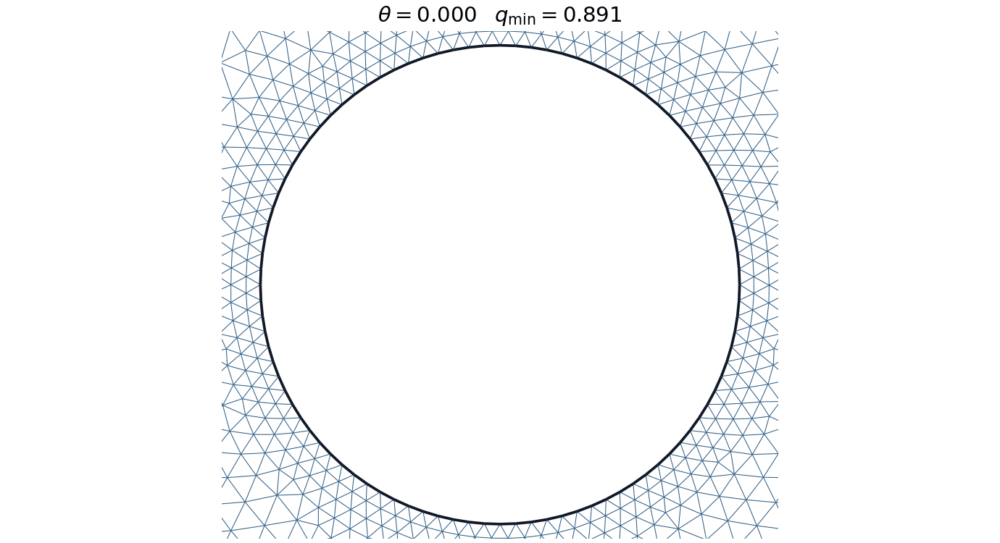
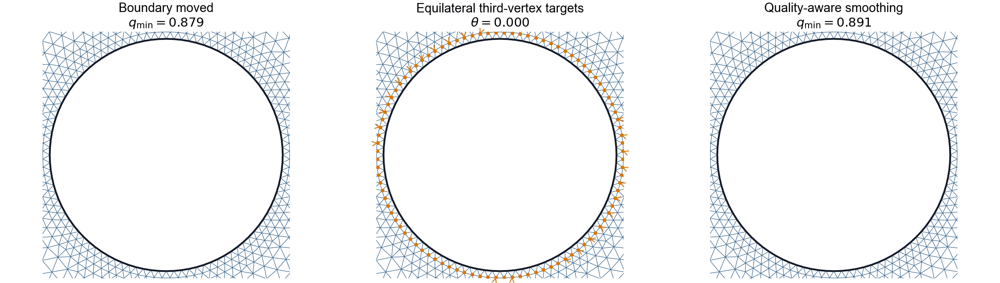
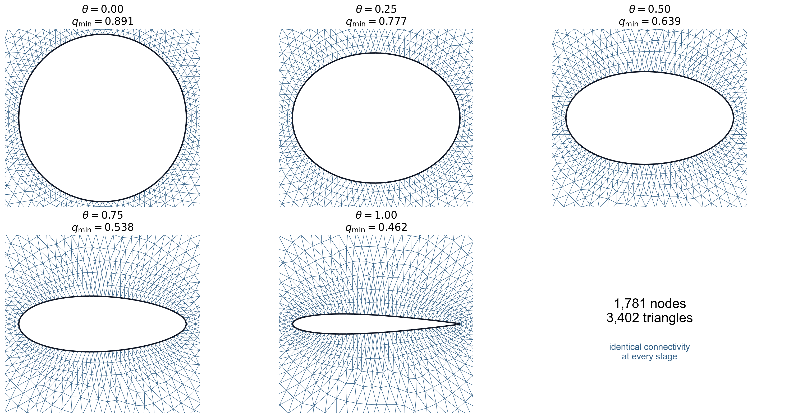
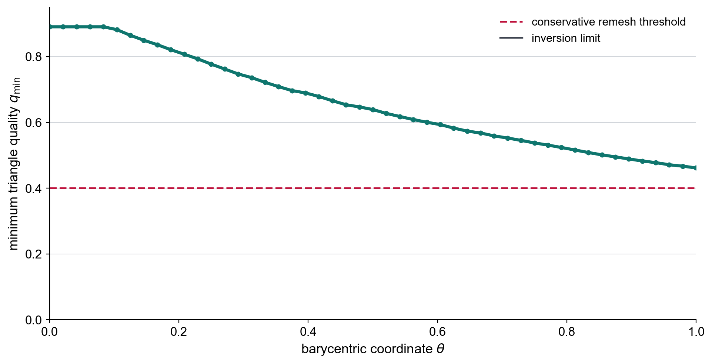

# Barycentric airfoil motion with fixed mesh topology

This example moves one AFEPack mesh from a circular internal boundary to a
NACA0012 airfoil without calling EasyMesh again.  No PDE is solved.

The upper and lower data files use the same chordwise coordinates.  Therefore
the simplest meaningful barycenter is the pointwise Euclidean interpolation

```text
D(theta) = (1 - theta) D_initial + theta D_target,  0 <= theta <= 1.
```

For equally spaced values of `theta`, this is the constant-speed straight path
in the vector of data ordinates.  Among discrete paths with the same endpoints
and number of steps, it minimizes

```text
sum_k ||D(theta_(k+1)) - D(theta_k)||^2.
```

This is not an optimal-transport barycenter: correspondence is already supplied
by the shared `x` grid, so an OT solve would add complexity without changing
the teaching point.

## Result animations

The first animation follows all 1,781 nodes while retaining one connectivity
throughout the circle-to-NACA0012 path.



The second animation exposes the three operations at each continuation stage:
boundary motion, equilateral third-vertex targets, and accepted
quality-improving smoothing.



## Main output figures

The selected mesh panels verify that all stages retain the same node and
element connectivity. The quality curve records the minimum element quality
over the complete continuation.

| fixed-topology mesh path | minimum quality along the path |
|---|---|
|  |  |

## Algorithm

1. Fit the circular data with the extracted Bezier implementation.
2. Call EasyMesh exactly once.
3. Construct each intermediate `dat` file from the barycentric formula.
4. Move the same boundary vertices to the next fitted boundary.
5. For every airfoil boundary edge, explicitly construct the ideal third
   vertex of an outward equilateral triangle.
6. Move the first interior ring toward these targets with a local line search.
   A move is retained only when the minimum quality of all incident triangles
   increases, so improving the boundary triangle cannot damage its next-ring
   neighbors.
7. Apply the same quality test to relaxed Laplacian proposals for the remaining
   interior vertices. This is a smart Laplacian smoother rather than an
   unconditional centroid update.
8. Accept the step only if no triangle is inverted and the requested quality
   floor is satisfied.
9. Verify that the element connectivity hash is identical at every stage.

If a proposed continuation step fails, only `delta_theta` is halved.  EasyMesh
is never used as a fallback.  If even the minimum step cannot pass the
requested quality floor, the program stops instead of silently changing
topology.

## Run

```bash
./run.sh
```

The default demonstration uses 48 barycentric steps, 20 boundary-quality and
smart-smoothing sweeps per step, and a minimum quality floor of `0.40`:

```bash
./run.sh --steps 48 \
  --smooth-iterations 0 \
  --boundary-quality-iterations 20 \
  --quality-floor 0.40
```

`--smooth-iterations` controls the old unconditional Laplacian pass and is
zero by default. It remains available for comparison. Increasing its iteration
count does not necessarily improve triangle quality because an ordinary
centroid update has no quality objective.

On the supplied circle-to-NACA0012 path, the mesh keeps:

```text
1,781 nodes
3,402 triangles
0 inverted triangles
the same connectivity SHA-256 at every stage
```

The final minimum triangle quality is approximately `0.462`, so the complete
path stays above the `q_min >= 0.40` threshold used by the digital-twin
example. For comparison, 400 unconditional Laplacian sweeps per stage produced
approximately `q_min = 0.243` at the final airfoil. This distinction is useful
in class:

- barycentric continuation prevents a large, abrupt deformation and avoids
  inversion in this example;
- smoothing needs a mesh-quality objective; more ordinary Laplacian sweeps are
  not automatically better;
- the equilateral target is not imposed blindly because the exact target can
  invert or flatten a triangle in the next layer;
- the local line search makes the accepted minimum quality nondecreasing
  during each smart-smoothing pass;
- barycentric motion still does not mathematically guarantee an arbitrary
  quality threshold;
- remeshing is still appropriate when high element quality is required.

## Outputs

```text
output/continuation.csv
output/summary.json
output/snapshots/stage_NNN.dat
output/snapshots/stage_NNN.mesh
output/snapshots/stage_NNN_nodes.csv
output/snapshots/stage_NNN_elements.csv
output/snapshots/stage_NNN_before.mesh
output/snapshots/stage_NNN_before_nodes.csv
output/snapshots/stage_NNN_before_elements.csv

output/figures/01_barycentric_data_path.png
output/figures/02_fixed_topology_mesh_path.png
output/figures/03_mesh_quality_along_path.png
output/figures/04_boundary_quality_smoothing.png
output/figures/barycentric_fixed_topology.gif
output/figures/barycentric_smoothing_mechanism.gif
```

The five selected mesh panels use the same node and element indices; only the
coordinates change. `barycentric_smoothing_mechanism.gif` shows the three
operations at every continuation coordinate: move the boundary, construct the
equilateral third-vertex targets, and accept quality-improving smart-smoothing
moves.

<!-- script-interface -->
## Script interfaces and portability

`./run.sh [BARYCENTRIC_MOTION_OPTIONS...]` resets the selected output,
forwards all options to `barycentric_motion.py`, and renders the default
`output/` figures. Direct interfaces are:

```text
python3 barycentric_motion.py [--steps N] [--smooth-iterations N]
    [--boundary-quality-iterations N] [--relaxation FLOAT]
    [--quality-floor FLOAT] [--max-halvings N] [--reset] [--output DIR]
python3 plot_results.py [OUTPUT_DIR] [--gif-dpi N]
```

Set `PYTHON_BIN`, `EASYMESH_BIN`, and `EASYMESH2MESH_BIN` when their
defaults are unsuitable. Backend build variables and the remaining output
layout are documented in the parent README and `backend/README.md`.
