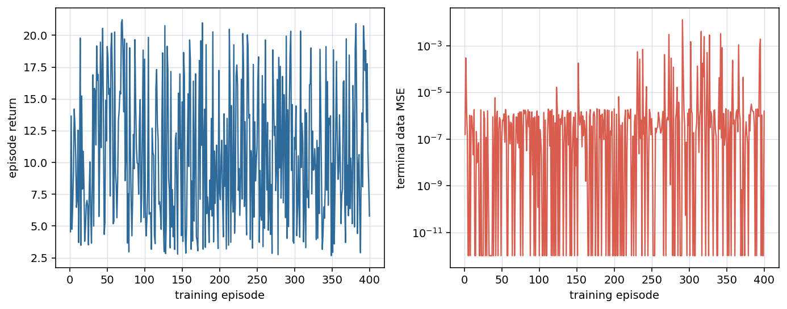
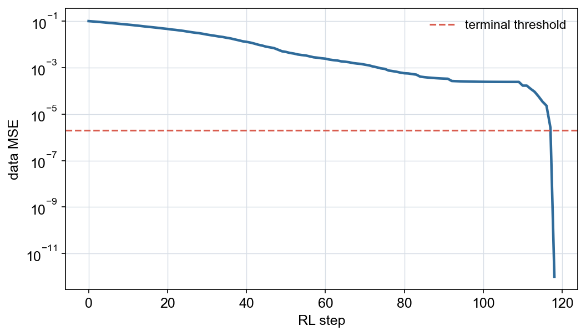

# Example 10 — Reinforcement learning in airfoil `dat` space

This example turns the circle-to-NACA0012 shape-matching problem into a small,
reproducible reinforcement-learning problem.  It deliberately does **not** call
AFEPack, EasyMesh, a mesh smoother, or a CFD solver.

## Result animation

The animation shows the greedy saved-policy rollout. The diamond marks the
Gaussian action selected at each step.


## Main output figures

The training curves summarize episode return and terminal data error. The
evaluation curve shows the saved greedy policy driving the circle-to-target
data MSE to zero.

| deterministic training history | saved-policy evaluation loss |
|---|---|
|  |  |

## RL problem

The state is the difference between the current and target movable ordinates:

\[
s_k =
\frac{1}{0.5}
\left[
y_{U,k}-y_U^\star,\;
y_{L,k}-y_L^\star
\right]\in\mathbb R^{128}.
\]

An action selects a surface, a chordwise center, and a signed Gaussian shift:

\[
a_k=(\mathrm{U/L},x_c,\Delta y),\qquad
y^{k+1}(x)=y^k(x)+
\Delta y\,\exp\!\left[-\frac{(x-x_c)^2}{2(0.12)^2}\right].
\]

Because the initial circle encloses the target, the safe action set compresses
the upper surface and raises the lower surface.  It contains 21 centers and
three magnitudes on each surface, for 126 actions.  An update is clipped when
it reaches the target, so it cannot overshoot.  The environment reports the
exact data-space objective

\[
J(D)=\frac{1}{2(N-2)}
\sum_{i=2}^{N-1}
\left[
(y_{U,i}-y_{U,i}^\star)^2+
(y_{L,i}-y_{L,i}^\star)^2
\right].
\]

The dense reward is the normalized one-step reduction in this objective, with
a small cost per step:

\[
r_k =
20\,\frac{J(D_k)-J(D_{k+1})}{J(D_0)}
-2\times10^{-3}.
\]

Double DQN learns a long-horizon action value \(Q_\theta(s,a)\).  Training
episodes reset to smooth shapes between the target and the initial circle;
evaluation always resets to the exact circle.

The reward normalization always uses the circle-to-target loss, so the
transition remains Markovian.  A Boolean action mask removes updates whose
Gaussian support contains no remaining error; it is a validity/no-op mask, not
an objective-based action ranking.

## Run

Use a Python environment with NumPy, PyTorch, Matplotlib, and ImageIO:

```bash
./run.sh
```

The default run is deterministic:

```bash
python3 train_dqn.py --episodes 400 --max-steps 140 --seed 2026
```

To render the saved policy again without retraining:

```bash
python3 train_dqn.py --evaluate-only --max-steps 140 --seed 2026
```

## Outputs

```text
output/checkpoints/dqn_best.pt
output/configuration.json
output/training.csv
output/training_history.png
output/evaluation/rollout.csv
output/evaluation/dat_history/step_*.dat
output/evaluation/final.dat
output/evaluation/shape_evolution.gif
output/evaluation/final_shape.png
output/evaluation/loss_history.png
```

Every evaluation state is a normal airfoil `dat` file.  The example therefore
isolates the RL idea from mesh validity and remeshing; the learned policy can
later be placed in front of the mesh-aware environment as a separate step.

## Tests

```bash
python3 -m unittest discover -s tests -v
```

<!-- script-interface -->
## Script interface and portability

`./run.sh [TRAIN_DQN_OPTIONS...]` forwards every argument to
`train_dqn.py`. The direct interface is:

```text
python3 train_dqn.py [--episodes N] [--max-steps N] [--seed N]
    [--batch-size N] [--warmup N] [--train-every N]
    [--terminal-loss FLOAT] [--fps N] [--gif-dpi N] [--evaluate-only]
```

All artifacts remain below `output/`; evaluate-only mode reads
`output/checkpoints/dqn_best.pt`. Set `PYTHON` for `run.sh` when the
required NumPy, PyTorch, Matplotlib, and ImageIO/Pillow packages are installed
in another interpreter. This example has no AFEPack, EasyMesh, OpenBLAS, or
Boost path settings.
