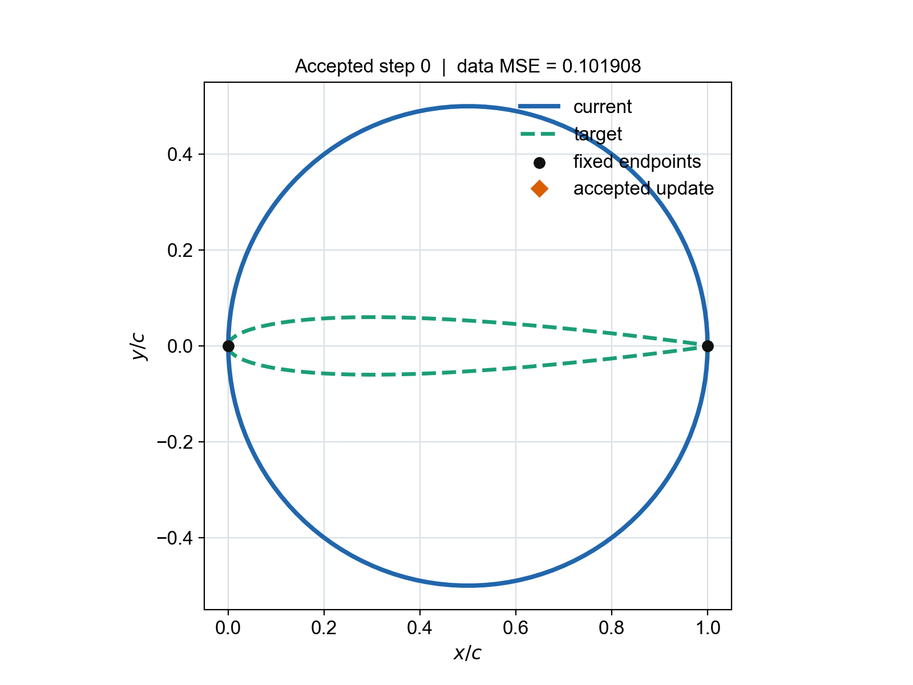
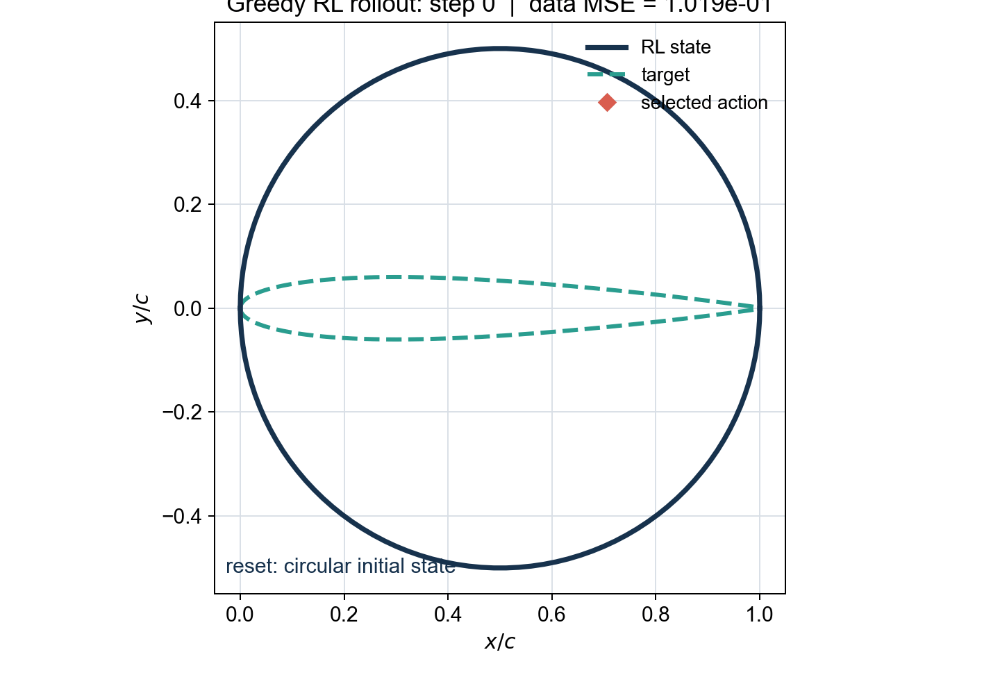

# AFEPack course examples

The examples are ordered by the concepts introduced in the short course:

1. `00_poisson_basic`: assemble and solve a conforming P1 Poisson problem.
2. `01_local_refinement`: compare independent and combined local indicators,
   and show how a scale coefficient can dominate a shared marking budget.
3. `02_mesh_merge`: independently refine the thick-stroke distance-zero sets
   for Tian and Yuan on a rectangle, then merge the two refinement histories
   into one Tianyuan mesh.
4. `03_residual_and_dual`: visualize the strong residual, perform
   residual-based primal refinement, solve a fully discrete dual on an
   independent mesh, and refine by dual magnitude.
5. `04_boundary_flux_dual`: place the heat source above a local cooled-boundary
   flux target and visualize the corresponding fully discrete dual.
6. `05_two_heater_goal_adaptivity`: compare residual and adjoint-weighted
   refinement for a smooth local-temperature functional with a spectral
   reference value.
7. `06_airfoil_mesh_motion`: fit airfoil data with regularized Bezier curves,
   generate an EasyMesh triangulation, move the airfoil boundary, and smooth
   the interior AFEPack mesh without changing connectivity.
8. `07_poisson_shape_optimization`: optimize a fixed-area Fourier boundary for
   a steady Poisson heat problem; a C++ coordinate search transforms an
   irregular multi-lobed shape into the optimal circle.
9. `08_airfoil_digital_twin`: learn and validate local upper/lower airfoil
   updates, move a persistent mesh, and remesh only when its quality becomes
   unacceptable.
10. `09_airfoil_barycentric_motion`: construct a constant-speed pointwise
    barycentric path from a circular profile to NACA0012, then move and smooth
    one fixed-topology mesh along that path without remeshing.
11. `10_airfoil_rl_dat`: train and evaluate a deterministic Double-DQN
    controller entirely in airfoil `dat` space, without calling AFEPack,
    EasyMesh, smoothing, or a CFD solver.

Examples `00`--`05` use the EasyMesh input
`common/mesh/unit_square/D.[nse]`. Examples `06`--`10` generate their own
geometry and mesh files. Generated outputs stay inside each example's own
`output/` directory.

## Selected result animations

The animations below are high-resolution presentation copies. Click an
animation to open the corresponding example and its reproducible workflow.

| mesh-aware digital twin (`08`) | fixed-topology barycentric motion (`09`) |
|---|---|
| [](08_airfoil_digital_twin/README.md) | [](09_airfoil_barycentric_motion/README.md) |

| quality-aware boundary smoothing (`09`) | pure-dat reinforcement learning (`10`) |
|---|---|
| [](09_airfoil_barycentric_motion/README.md) | [](10_airfoil_rl_dat/README.md) |

## Verified lecture commands

Run each command from the named example directory. The commands below were
retested on 2026-07-27.

| example | recommended command | purpose |
|---|---|---|
| `00_poisson_basic` | `./run.sh` | short AFEPack installation check |
| `01_local_refinement` | `./run.sh` | compare independent, equal-sum, and scale-dominated refinement |
| `02_mesh_merge` | `./run.sh 3 0.035` | build the Tian and Yuan peer meshes and merge them |
| `03_residual_and_dual` | `./run.sh` | residual, discrete dual, and one DWR step |
| `04_boundary_flux_dual` | `./run.sh` | manufactured boundary-flux target |
| `05_two_heater_goal_adaptivity` | `./run.sh ../common/mesh/unit_square/D --comparison-rounds 1 1 1` | fast three-strategy classroom comparison |
| `06_airfoil_mesh_motion` | `python3 airfoil_step.py --reset`, then `python3 airfoil_step.py 0.50 U -0.02 --width 0.12 --smooth-iterations 200` | one safe fixed-topology boundary action |
| `07_poisson_shape_optimization` | `./run.sh output 4` | four coordinate-search sweeps with remeshing |
| `08_airfoil_digital_twin` | `./run_teaching_demo.sh` | reset and run the complete seed-2026 digital-twin experiment |
| `09_airfoil_barycentric_motion` | `./run.sh --steps 48 --smooth-iterations 0 --boundary-quality-iterations 20 --quality-floor 0.40` | fixed-topology disk-to-NACA0012 path |
| `10_airfoil_rl_dat` | `PYTHON=python3 ./run.sh --evaluate-only --max-steps 140 --seed 2026` | reload and evaluate the saved RL checkpoint |

Use `PYTHON_BIN=/path/to/python` for examples `08` and `09`, or
`PYTHON=/path/to/python` for example `10`, when the required Python packages
are installed in a non-default interpreter. Full RL retraining uses
`PYTHON=python3 ./run.sh --episodes 400 --max-steps 140 --seed 2026`.

<!-- script-interface -->
## Portable configuration

The checked-in scripts use repository-relative input and output paths. Generated
artifacts belong in each example's `output/` directory; generated output,
cache, and figure directories intentionally do not contain their own README.
Every source, package, backend, test, and checked-in data directory does.

The build defaults reflect the original macOS/MacPorts environment. Other users
should define only the variables whose defaults do not match their installation:

| variable | used by | default | define when |
|---|---|---|---|
| `CXX` | C++ Makefiles | Make's C++ compiler | a different C++20 compiler is required |
| `AFEPACK_PREFIX` | C++ Makefiles | `$HOME` | AFEPack headers/libraries use another prefix |
| `OPENBLAS_PREFIX` | C++ Makefiles | `/opt/local` | OpenBLAS is not installed by MacPorts |
| `BOOST_INCLUDE` | C++ Makefiles | `/opt/local/libexec/boost/1.81/include` | Boost headers are elsewhere |
| `AFEPACK_PATH` | examples 00, 02--05 | `$HOME/include/AFEPack` | AFEPack runtime data are elsewhere |
| `AFEPACK_TEMPLATE_PATH` | examples 00, 02--05, 07 | under `$HOME/include/AFEPack/template` | AFEPack templates are elsewhere |
| `EASYMESH_BIN` | examples 02, 06--09 | `$HOME/bin/easymesh` | EasyMesh is elsewhere |
| `EASYMESH2MESH_BIN` | examples 06, 08, 09 | `$HOME/bin/easymesh2mesh` | the converter is elsewhere |
| `PLOT_PYTHON` | examples 01, 02, 06 | auto-detected | plotting packages are in another interpreter |
| `PYTHON_BIN` | examples 08, 09 | `$HOME/anaconda3/bin/python` if present, otherwise `python3` | another Python environment is needed |
| `PYTHON` | example 10 | `python3` | another Python environment is needed |

For example:

```bash
export CXX=/usr/bin/c++
export AFEPACK_PREFIX=/opt/afepack
export OPENBLAS_PREFIX=/opt/openblas
export BOOST_INCLUDE=/opt/boost/include
export EASYMESH_BIN=/opt/easymesh/bin/easymesh
export EASYMESH2MESH_BIN=/opt/easymesh/bin/easymesh2mesh
```

Root-mesh paths are command-line parameters, not machine constants. Keep the
provided `common/mesh/unit_square/D` basename or pass another EasyMesh basename
without the `.n`, `.e`, or `.s` suffix.
